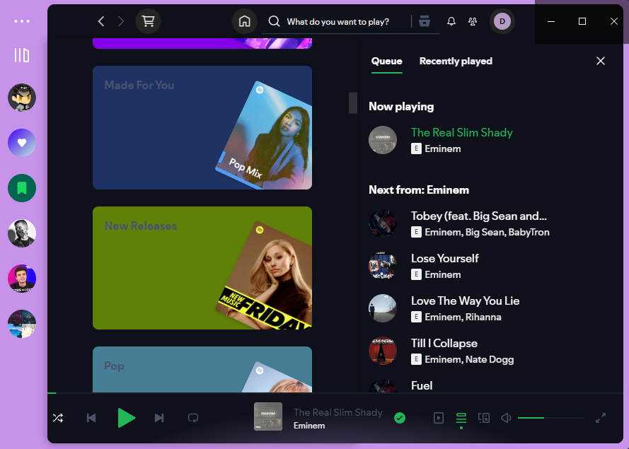

# Spicetify Custom Theme

This is a custom Spicetify theme based on the Dribbblish theme. Follow the steps below to install and apply it.

### Preview


## Prerequisites

- Ensure you have [Spicetify](https://github.com/spicetify/spicetify-cli) installed.

## Installation Steps

1. **Copy the Theme Folder**

   Copy the theme folder into the Spicetify themes directory. The path to this directory can be found by running the `spicetify -c` command. 

2. **Apply the Theme**

   - **Linux and macOS:**

     Open a terminal and run the following commands:

     ```bash
     cd "$(dirname "$(spicetify -c)")/Themes"
     spicetify config current_theme Spicetify-Theme color_scheme base
     spicetify config inject_css 1 replace_colors 1 overwrite_assets 1 inject_theme_js 1
     spicetify apply
     ```

   - **Windows:**

     Open PowerShell and run the following commands:

     ```powershell
     cd "$(spicetify -c | Split-Path)\Themes"
     spicetify config current_theme Spicetify-Theme color_scheme base
     spicetify config inject_css 1 replace_colors 1 overwrite_assets 1 inject_theme_js 1
     spicetify apply
     ```

## Customization

You can customize the theme by modifying the CSS files and other assets included in the theme folder. Make sure to reapply the theme using `spicetify apply` after making any changes.

## Troubleshooting

If you encounter any issues, ensure that:
- You have Spicetify properly installed and configured.
- The theme folder is correctly copied to the Spicetify themes directory.
- You have followed all the installation steps correctly.

For further assistance, please refer to the [Spicetify documentation](https://github.com/spicetify/spicetify-cli) or seek help in the [Spicetify community](https://github.com/spicetify/spicetify-cli/issues).

Enjoy your new Spicetify theme!
